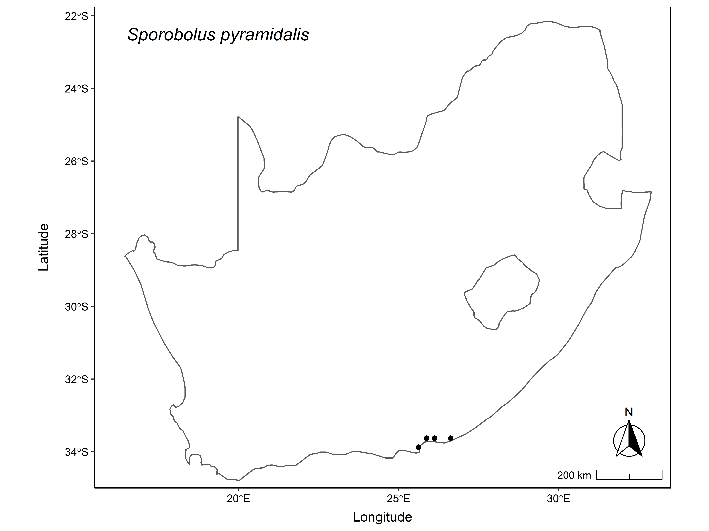
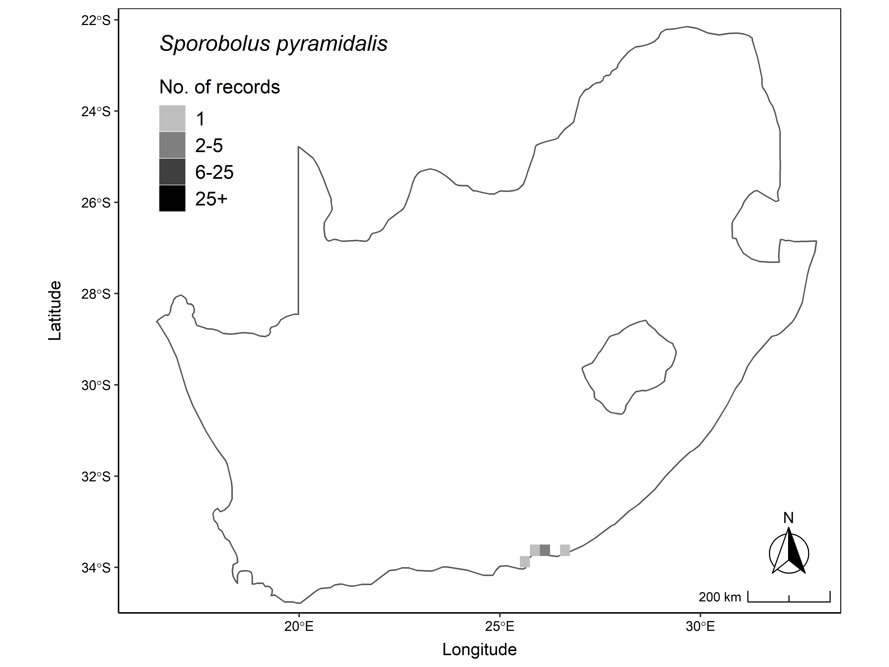

# Produce SAPIA-style maps 

The Southern African Plant Invaders Atlas (SAPIA), lead by Lesley Henderson, is a valuable resource for managing invasive alien plants in South Africa. SAPIA collects and digitises information on the distribution, abundance and habitat types for naturalised and invasive alien plants in southern Africa. 

The SAPIA database is arguably the most comprehensive database on invasive alien plants in southern Africa - housing approximately 60 000 locality records for 600 alien plant species in 1 500 ¼° squares (QDGC), distributed across South Africa, Swaziland and Lesotho. 

This repo contains R code and functions that allows users to produce their own SAPIA-style maps. 

# Examples

## (1) Users can produce a standard SAPIA-style map, showing the presence/absence per ¼° squares (QDGC). 

## (2) Alternatively, users can produce an abundance plot, which shows the no. of records per ¼° squares (QDGC).

